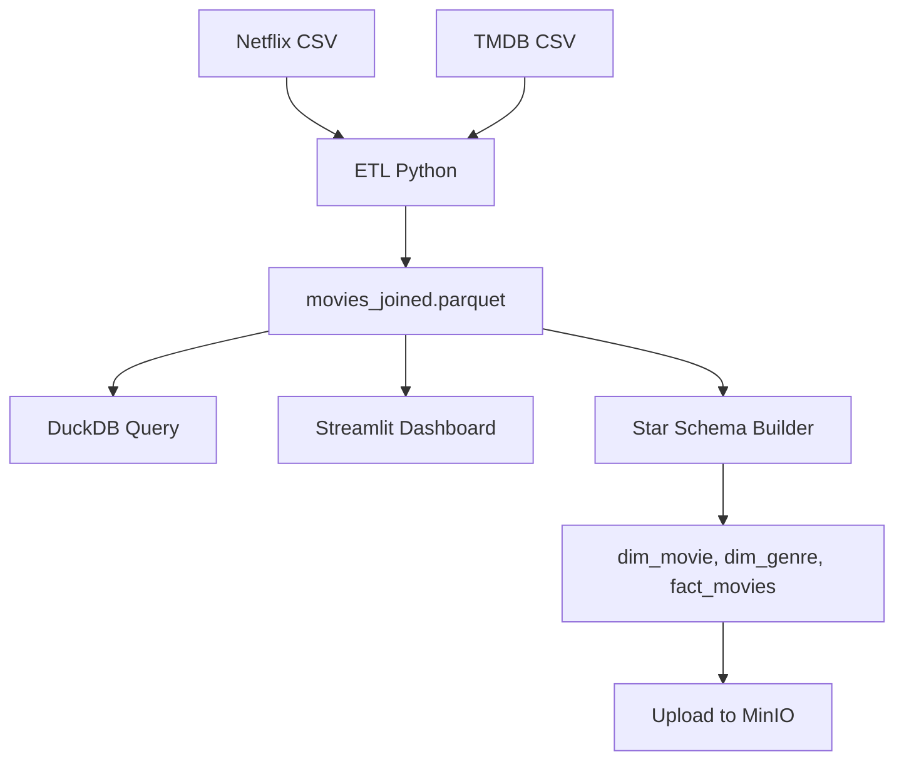

# 🎬 Netflix + TMDB Data Engineering Pipeline


---

## 📌 Project Overview

This project is an **end-to-end Data Engineering pipeline** built to extract, transform, analyze, and visualize movie data from Netflix and TMDB. The pipeline processes raw CSV files into Parquet format, applies star schema modeling, and stores outputs in a MinIO-based data lake for analytics and dashboarding.

---

## 🛠️ Tech Stack

- **Python**: ETL and data processing
- **pandas**, **pyarrow**: data manipulation and Parquet conversion
- **DuckDB**: in-process SQL engine for Parquet analytics
- **MinIO**: S3-compatible object storage for data lake
- **Streamlit**: interactive web-based dashboard

---

## 🧱 Pipeline Architecture



---

## 📁 Project Structure

```
netflix-tmdb-pipeline/
├── data/
│   ├── raw/                # Raw source CSV files
│   ├── processed/          # Joined & cleaned output
│   └── star_schema/        # Dimensional model tables
├── etl/                    # ETL pipeline scripts
├── minio/                  # MinIO upload tools
├── analysis/               # DuckDB SQL queries
├── dashboard/              # Streamlit dashboard app
└── README.md
```

---

## ⚙️ How to Run

### 1. Run the ETL pipeline
```bash
python etl/pipeline.py
```

### 2. Run analytical queries
```bash
python analysis/query_duckdb.py
```

### 3. Build star schema
```bash
python etl/star_schema.py
```

### 4. Upload files to MinIO
```bash
python minio/upload_parquet.py
python minio/upload_star_schema.py
```

### 5. Launch the dashboard
```bash
streamlit run dashboard/streamlit_app.py
```

---

## 🧠 DuckDB Query Examples

- Average movie rating by Netflix genre
- Popularity trends over the years
- Count of movies per genre

---

## 📊 Dashboard Streamlit

> Provides interactive visualization and exploration of Netflix + TMDB data:

- Top 10 highest-rated movies
- Filter by content type and release year
- Popularity trend by year
- Genre distribution

📸 (*Tambahkan screenshot dashboard di sini jika ada*)

---

## 🧠 Star Schema (Dimensional Model)

| Table         | Deskripsi                          |
|---------------|------------------------------------|
| `dim_movie`   | Basic movie information            |
| `dim_genre`   | Genre labels from Netflix and TMDB |
| `dim_date`    | Derived release year metadata      |
| `fact_movies` | Metrics: rating, votes, popularity |

---

## 👤 Author

**Ihsan Kamil**  
📧 ihsankamil.112@gmail.com  
🔗 [GitHub](https://github.com/Deceitfulz) | [LinkedIn](https://linkendin.com/in/ihsan112)

---

## 📄 Lisensi

MIT License © 2025 Ihsan Kamil